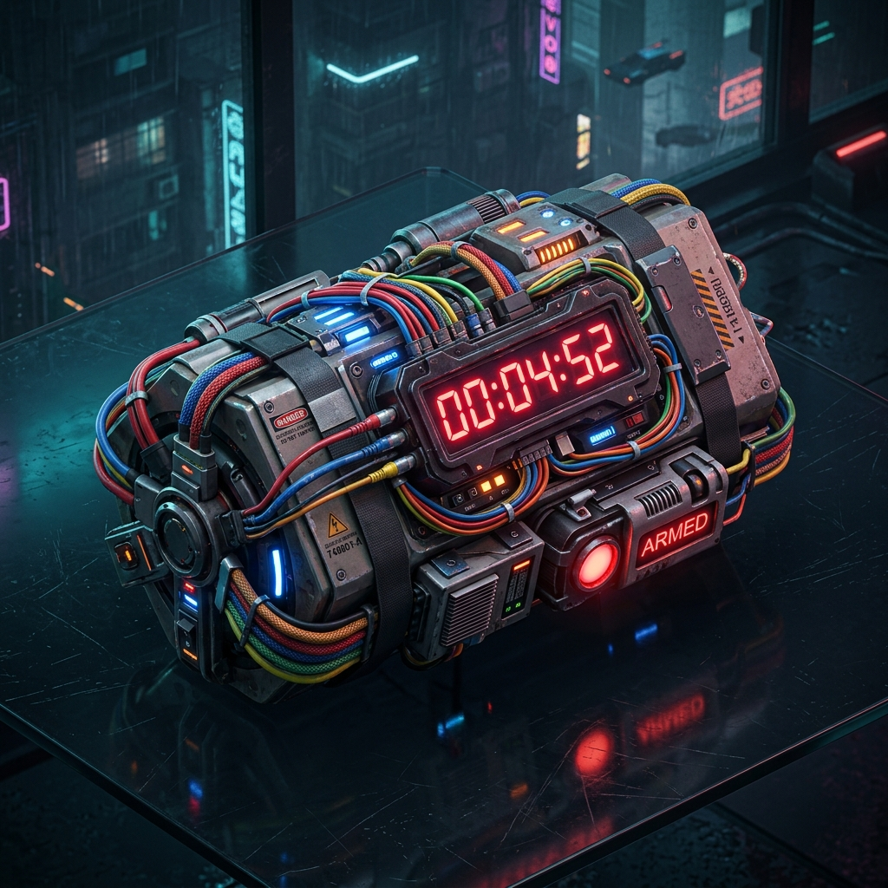

# 💣 Defuse The Bomb 3D - 3D Parti & Bomba İmha Oyunu



**Defuse The Bomb 3D**, arkadaşlarınızla aynı Wi-Fi ağında veya aynı cihazda oynayabileceğiniz, hızlı tempolu, kahkaha dolu bir **3D parti ve bomba imha oyunudur**!

Tıpkı *UNO* ve *Keep Talking and Nobody Explodes* karışımı gibi: Soruları bil, rakibine aksiyon kartı fırlat ve bomba senin elinde patlamadan kabloları imha et! 💣🔥

---

## ✨ Öne Çıkan Özellikler

* 🌐 **Oda Kodu ile Çok Oyunculu (Multiplayer)**: Herkes kendi cep telefonundan veya bilgisayarından oda kodu girerek oyuna katılabilir.
* 🎲 **5 Kablo Şans Ruleti**: Yanlış cevap verildiğinde 5 kablodan 1'i kesilir (1/5 patlama ve can kaybetme şansı).
* 🎴 **8 Farklı UNO Aksiyon Kartı**:
  * 🔀 **BOMBAYI PASLA**: Bombayı sıradaki oyuncuya fırlat!
  * 🔄 **YÖNÜ TERS ÇEVİR**: Tur sırasını tersine döndür!
  * ✂️ **KABLO KESTİR**: Bombadan zorla 1 kablo kestir!
  * ⚡ **ZAMANI HIZLANDIR**: Bombanın süresini 5 saniyeye düşür!
  * ⏳ **+5 SANİYE EKLE**: Sürene ekstra 5 saniye ekle!
  * 🛡️ **BOMBA KALKANI**: Patlamadan 1 defalık korun!
  * 🎲 **KABLOLARI SIFIRLA**: Tüm kesilmiş kabloları yenile!
  * 🃏 **RAKİPTEN KART ÇAL**: Desteden +1 aksiyon kartı çek!
* 🎭 **3D Karakter Avatarları**: Çılgın Maymun, Cyber Robot, Ninja Kedi, Hacker Tilki, Uzaylı Alien ve Gamer Ayı.
* ⚡ **1 Bakışta Anlaşılan 3 Bölümlü Arayüz**: Oyuncular panosu, parlayan canlı bomba + soru ve sizin aksiyon kartlarınız.

---

## 🚀 Hızlı Başlangıç (Kurulum)

Projeyi bilgisayarınızda çalıştırmak için aşağıdaki adımları izleyin:

```bash
# 1. Depoyu klonlayın
git clone https://github.com/berenysrr/defuse-the-bomb.git

# 2. Proje klasörüne girin
cd defuse-the-bomb

# 3. Bağımlılıkları yükleyin
npm install

# 4. Geliştirici sunucusunu başlatın
npm run dev
```

Sunucu başladıktan sonra tarayıcınızda `http://localhost:3000` (veya `3001`) adresinden oyuna girebilirsiniz!

---

## 🌐 Yerel Ağda (Wi-Fi) Arkadaşlarınla Oyna

Oyunu aynı Wi-Fi ağına bağlı diğer telefon ve tabletlerde yayınlamak için:

1. Sunucuyu başlattığınızda terminalde çıkan **Network** IP adresini alın (Örn: `http://192.168.1.134:3001`).
2. Arkadaşlarınız kendi telefonlarından bu adrese girsin.
3. **"ODA OLUŞTUR"** butonuna basarak oda kodunu paylaşın veya arkadaşlarınız **"ODAYA KATIL"** seçeneği ile katılsın!

---

## 🛠️ Kullanılan Teknolojiler

* **Frontend**: React.js, Vite
* **Animasyon & 3D Visuals**: Framer Motion, Three.js (`@react-three/fiber`, `@react-three/drei`), Canvas Confetti
* **İkonlar**: Lucide React
* **Ses & Efektler**: Web Audio API Synthesizer (Harici MP3 gerektirmez)

---

## 📜 Lisans

Bu proje MIT lisansı ile korunmaktadır. Özgürce geliştirebilir ve paylaşabilirsiniz! 🎈
